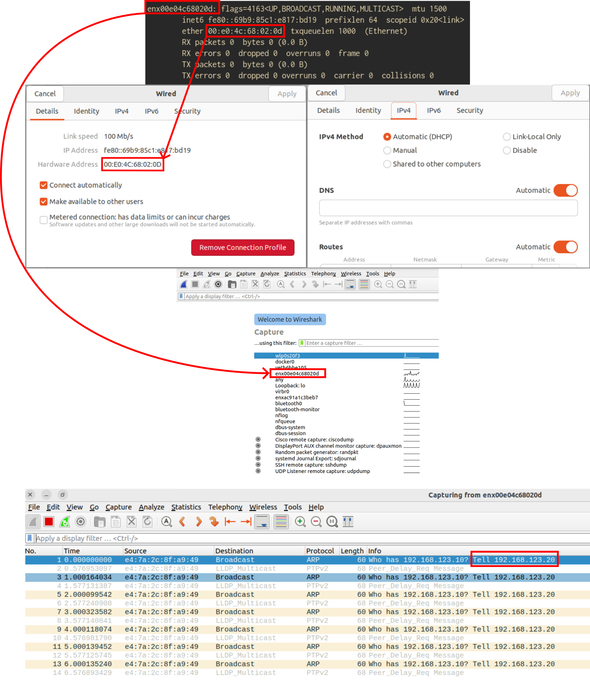

# Hardware Docker images

> **Stop recompiling every LiDAR or camera driver in every workspace.**
> **Build once, deploy the Docker container anywhere, move on.**

---

## Table of Contents

- [Hardware Docker images](#hardware-docker-images)
  - [Table of Contents](#table-of-contents)
  - [Why this repository exists](#why-this-repository-exists)
  - [Repository anatomy](#repository-anatomy)
  - [Building an image](#building-an-image)
    - [Building a single-sensor example image](#building-a-single-sensor-example-image)
    - [Building a multi-sensor example image](#building-a-multi-sensor-example-image)
    - [Dockerfile template](#dockerfile-template)
  - [Launching a container of the sensor Docker image](#launching-a-container-of-the-sensor-docker-image)
    - [Entrypoint](#entrypoint)
    - [Custom launch file](#custom-launch-file)
  - [ROS1 is not supported](#ros1-is-not-supported)
  - [How to Find a Sensor IP](#how-to-find-a-sensor-ip)

---

## Why this repository exists

When we want to publish sensor data to ROS2, sometimes there is a ready-made package in the OS repositories.
When there is not, we must build vendor drivers and ROS2 wrappers from source. That is slow, fragile, and
hard to reproduce across laptops, CI, and robots.

**The approach here** is to package each driver (code + native deps + ROS2 wrapper) inside its own Docker image.
That way a project only needs to build (or pull) a known image and run it.

Example docker-compose service to launch a RoboSense LiDAR:

```yaml
services:
  robosense_srvc:
    image: ${IMG_ID}
    network_mode: host
    privileged: false
    ipc: host
    volumes:
      - ./example_1.front_robosense_helios_16p_config.yaml:/tmp/config.yaml:ro
      # - ./example_2.front_back_robosense_helios_16p_config.yaml:/tmp/config.yaml:ro
      - ./cyclonedds_config.xml:/tmp/cyclonedds_config.xml:ro
    environment:
      TERM: xterm-256color
      RCUTILS_LOGGING_BUFFERED_STREAM: "0"
      RCUTILS_LOGGING_USE_STDOUT: "1"
      RCUTILS_COLORIZED_OUTPUT: "1"
      RCUTILS_CONSOLE_OUTPUT_FORMAT: "[{severity} {time}] [{name}]: {message} ({file_name}:L{line_number})"
      RMW_IMPLEMENTATION: rmw_cyclonedds_cpp
      CYCLONEDDS_URI: file:///tmp/cyclonedds_config.xml
      ROS_DOMAIN_ID: "11"
      NAMESPACE: test # Optional
      ROBOT_NAME: robot # Required
      CONFIG_FILE: /tmp/config.yaml # Required
      NODE_OPTIONS: "name=robosense_lidar_ros2_handler,output=screen,emulate_tty=True,respawn=False,respawn_delay=0.0"
      LOGGING_OPTIONS: "log-level=info,disable-stdout-logs=true,disable-rosout-logs=false,disable-external-lib-logs=true"
    command: ["ros2", "launch", "rslidar_sdk", "sensor.launch.py"]
```

## Repository anatomy

This repository is organized to provide a modular approach to building Docker images for various hardware sensors in ROS2 environments. Here's a conceptual overview of what you'll find:

- **Base Docker Files**: Core scripts and configurations for setting up the foundational Docker environment, including system dependencies, ROS2 installation, and build tools. These are reusable across different sensor types.

- **Example Multi-Sensor**: A demonstration of how to combine multiple sensors into a single Docker image, showing best practices for multi-sensor setups and custom Dockerfile creation.

- **Sensors Directory**: A collection of sensor-specific implementations, categorized by sensor type (cameras, IMUs, lidars). Each sensor folder contains:
  - Installation scripts for vendor drivers and dependencies
  - Compilation scripts for building ROS2 wrappers
  - Standardized launch files for consistent sensor integration
  - Example configurations and Docker setups to get started quickly

**ROS2 distributions currently supported** (see `base_docker_files/ros_distros.yaml`):

| ROS2 codename       | Ubuntu base | Notes             |
| ------------------- | ----------- | ----------------- |
| Humble Hawksbill    | 22.04 LTS   | EOL May 2027      |
| Jazzy Jalisco       | 24.04 LTS   | EOL May 2029      |

## Building an image

### Building a single-sensor example image

Each sensor folder includes an `examples/` directory with a `Dockerfile` and a `build.py` that builds a
single-driver image using the scripts under that sensor folder.

Examples:

```bash
python3 sensors/cameras/realsense/examples/build.py jazzy
python3 sensors/lidars/robosense/examples/build.py jazzy
python3 sensors/lidars/livox_gen2/examples/build.py jazzy
python3 sensors/imus/umx/examples/build.py jazzy
```

### Building a multi-sensor example image

See `example_multi_sensor/README.md`. The example shows how a user can create a custom Dockerfile that
clones this repository and reuses existing `setup.sh` and `compile.sh` scripts for multiple sensors.

```bash
python3 example_multi_sensor/build.py ubuntu:24.04 jazzy multi_sensor:jazzy
```

### Dockerfile template

Each image follows a common structure:

1. Base system install (`base_docker_files/install_base_system.sh`).
2. ROS2 install (`base_docker_files/install_ros.sh`).
3. Sensor setup (`sensors/<type>/<name>/setup.sh`).
4. rosdep + colcon mixin/metadata (`base_docker_files/rosdep_init_update_install.sh` and `colcon_mixin_metadata.sh`).
5. Compile (`sensors/<type>/<name>/compile.sh`).
6. Install entrypoint (`base_docker_files/entrypoint.sh`).

The example Dockerfiles in `examples/` follow this pattern and can be copied to new projects.

## Launching a container of the sensor Docker image

### Entrypoint

The entrypoint script sources `${IMAGE_MAIN_USER_WORKSPACE}/install/setup.bash` so ROS2 packages can be found:

```bash
#!/usr/bin/env bash

ws="${IMAGE_MAIN_USER_WORKSPACE:-}"
[ -n "${ws}" ] && [ -r "${ws}/install/setup.bash" ] && . "${ws}/install/setup.bash"

exec "$@"
```

### Custom launch file

Each sensor provides a `sensor.launch.py` that wraps the vendor driver in a consistent launch entrypoint.
The Dockerfiles install that launch file into the driver package so it can be run with `ros2 launch`.

Check each sensor folder for examples of how to use the launch file and what parameters are supported, since they might vary a little among sensors.

## ROS1 is not supported

This repository targets ROS2 only.

## How to find a sensor IP

1. Connect the sensor to your computer with an RJ45 cable (directly or through a hub/switch).
2. Run `ifconfig` and identify the network interface connected to the sensor.
3. Note the MAC address of that interface (example: `enx00e04c68020d` with MAC `00:e0:4c:68:02:0d`).
4. Open the network manager and select that interface.
5. Optionally verify you selected the correct interface by checking that its MAC address matches the one from `ifconfig`.
6. Set that interface to `Automatic (DHCP)`.
7. Open a terminal and start Wireshark. If needed, install it first: `sudo apt-get install -y wireshark`.
8. In Wireshark, select the interface and start traffic capture.
9. Inspect captured packets and find messages coming from the LiDAR that show its IP address.
10. Configure your computer interface with an IP in the same subnet/range as the LiDAR.
11. Verify connectivity with `ping <LiDAR_IP>`.


